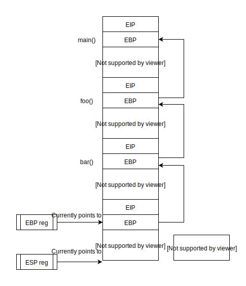

## Unwinding stack in school
If we wanna understand how to unwind the stack, we need know how the system invoke a function. Let's recall some memory from school.


(1) We're in `func main()` and prepare to invoke `func foo()`, caller pushes parameters in the reverse order before executing the call instruction.(The first param is at top of the stack at the time of the Call)
(2) Invoke `call foo()`, push $EIP to stack and load the address of `foo()` to EIP
(3) Enter `foo()`, and run prolog that will push old EBP, and assign current EBP to ESP to form a new function stack.
(4) Execute `foo()` body.
(5) Finish executing `foo()` and prepare return, run epilog to restore ESP and EBP to their old values
(6) Execute ret, pop current stack top to %EIP and ESP $n*4 to pop all parameters and execute post instrument.

All the registers are named using x86, here is the name mapping for ARM:
```
r7/r11 – Frame Pointer (EBP on x86).
In AArch32, the frame pointer is stored in register R11 for ARM code or register R7 for Thumb code.
In AArch64, the frame pointer is stored in register X29
SP (r13) – Stack Pointer (ESP on x86).
LR (r14) – Link Register.  Used as a return address to the caller.
```

Lets' zoom up the stack, it will much clear on the big picture.


EBP and ESP point to the base and top of the stack frame of currently executing function. All other stack frames save EBP and EIP values before transferring control to another function.




We can get the backtrace via below code snippets:
```
void debugger::print_backtrace() {
    auto curr_func = get_func_from_pc(get_pc());
    output_frame(curr_func);

    auto frame_pointer = get_register_value(m_pid, reg::rbp);
    auto return_address = read_mem(frame_pointer+8);

    while (dwarf::at_name(curr_func) != "main") {
        curr_func = get_func_from_pc(ret_addr);
        output_frame(curr_func);
        frame_pointer = read_mem(frame_pointer);
        return_address = read_mem(frame_pointer+8);
    }
}
```
It looks very elegance, but the real world is dirty. ARM won't guarantee the `frame-pointer` even we passed `-fno-omit-frame-pointer` to compiler.
In order to make effective use of the APCS, compilers must compile code a procedure at a time.
In the case of leaf functions, much of the standard entry sequence can be omitted.
In very small functions, such as those that frequently occur implementing data abstractions, the function-call overhead can be tiny.  check [APCS Doc](https://www.cl.cam.ac.uk/~fms27/teaching/2001-02/arm-project/02-sort/apcs.txt#1018)this for detail

## Unwinding stack in real world
