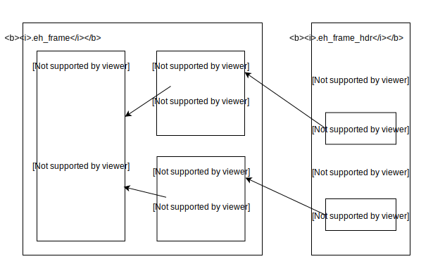

## Unwinding stack in school
If we wanna understand how to unwind the stack, we need know how the system invoke a function. Let's recall some memory from school.


* (1) We're in `func main()` and prepare to invoke `func foo()`, caller pushes parameters in the reverse order before executing the call instruction.(The first param is at top of the stack at the time of the Call)
* (2) Invoke `call foo()`, push $EIP to stack and load the address of `foo()` to EIP
* (3) Enter `foo()`, and run prolog that will push old EBP, and assign current EBP to ESP to form a new function stack.
* (4) Execute `foo()` body.
* (5) Finish executing `foo()` and prepare return, run epilog to restore ESP and EBP to their old values
* (6) Execute ret, pop current stack top to %EIP and ESP $n*4 to pop all parameters and execute post instrument.

All the registers are named using x86, here is the name mapping for ARM:
```
r7/r11 – Frame Pointer (EBP on x86).
In AArch32, the frame pointer is stored in register R11 for ARM code or register R7 for Thumb code.
In AArch64, the frame pointer is stored in register X29
SP (r13) – Stack Pointer (ESP on x86).
LR (r14) – Link Register.  Used as a return address to the caller.
```

Lets' zoom up the stack, it will much clear on the big picture.


EBP and ESP point to the base and top of the stack frame of currently executing function. All other stack frames save EBP and EIP values before transferring control to another function.


We can get the backtrace via below code snippets:
```
void debugger::print_backtrace() {
    auto curr_func = get_func_from_pc(get_pc());
    output_frame(curr_func);

    auto frame_pointer = get_register_value(m_pid, reg::rbp);
    auto return_address = read_mem(frame_pointer+8);

    while (dwarf::at_name(curr_func) != "main") {
        curr_func = get_func_from_pc(ret_addr);
        output_frame(curr_func);
        frame_pointer = read_mem(frame_pointer);
        return_address = read_mem(frame_pointer+8);
    }
}
```
It looks very elegant, but the real world is dirty. ARM won't guarantee the `frame-pointer` even we passed `-fno-omit-frame-pointer` to compiler.
There're at least two cases for compilers won't follow this elegant frame stack, check [APCS Doc](https://www.cl.cam.ac.uk/~fms27/teaching/2001-02/arm-project/02-sort/apcs.txt#1018) for details:
* In the case of leaf functions, much of the standard entry sequence can be omitted.
* In very small functions, such as those that frequently occur implementing data abstractions, the function-call overhead can be tiny.


## Unwinding stack in real world
How can we unwind stack without a frame pointer?
The modern way to specify unwind information is in the `.debug_frame` section. But we never ship `.debug_frame` to release build, the compiler will use similar but much smaller sections to help use unwind. On x86 & ARMv8 platfomr they're `.eh_frame` and `.eh_frame_hdr`.`.ARM.extab` and `.ARM.exidx` are for ARM32. They're quite similar, we only discuss `.eh_frame` in follow-up. If you're interested on `.ARM.extab`, you can check [<ARM-Unwinding-Tutorial>](https://sourceware.org/binutils/docs/as/ARM-Unwinding-Tutorial.html)


### ".eh_frame" and ".eh_frame_hdr"
The `.eh_frame` section follows [DWARF](http://www.dwarfstd.org/doc/DWARF4.pdf) format. DWARF uses a data structure called a Debugging Information Entry (DIE) to represent each variable, type, procedure, etc. It uses a very smart way to represent a big table for every address in program text describes how to set registers to restore the previous call frame.


 >CFA(Canonical Frame Address). Address other addresses within the call frame can be relative to

The `.eh_frame` section contains at least one CFI(Call Frame Information). Each CFI consists of two entry forms: single CIE(Common Information Entry) and at least one FDE(Frame Description Entry). CFI usually corresponds to a single obj file. Likewise, so does FDE to a single function.

The [`.eh_frame_hdr`](https://refspecs.linuxfoundation.org/LSB_1.3.0/gLSB/gLSB/ehframehdr.html) section contains a series of attributes, followed by the table of multiple pairs of (initial location, pointer to the FDE in the `.eh_frame`). The entries are sorted by functions that allows to search item in O(log n) via binary search.



Here are some key functions of GCC to understand how to use `.eh_frame`
[_Unwind_Backtrace](https://gcc.gnu.org/git/gitweb.cgi?p=gcc.git;a=blob;f=libgcc/unwind.inc;h=12f62bca7335f3738fb723f00b1175493ef46345;hb=HEAD#l275),
[uw_frame_state_for](https://gcc.gnu.org/git/gitweb.cgi?p=gcc.git;a=blob;f=libgcc/unwind-dw2.c;h=b262fd9f5b92e2d0ea4f0e65152927de0290fcbd;hb=HEAD#l1222),
[uw_update_context](https://gcc.gnu.org/git/gitweb.cgi?p=gcc.git;a=blob;f=libgcc/unwind-dw2.c;h=b262fd9f5b92e2d0ea4f0e65152927de0290fcbd;hb=HEAD#l1494),
[uw_update_context_1](https://gcc.gnu.org/git/gitweb.cgi?p=gcc.git;a=blob;f=libgcc/unwind-dw2.c;h=b262fd9f5b92e2d0ea4f0e65152927de0290fcbd;hb=HEAD#l1376)


Good to read:
* https://stackoverflow.com/questions/15752188/arm-link-register-and-frame-pointer
*  http://infocenter.arm.com/help/index.jsp?topic=/com.arm.doc.dui0774g/vvi1466179578564.html
* http://blog.reverberate.org/2013/05/deep-wizardry-stack-unwinding.html
* https://eli.thegreenplace.net/2015/programmatic-access-to-the-call-stack-in-c/
* http://www.hexblog.com/wp-content/uploads/2012/06/Recon-2012-Skochinsky-Compiler-Internals.pdf
* http://www.airs.com/blog/archives/460
